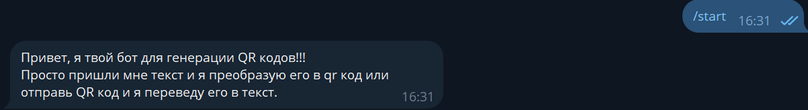
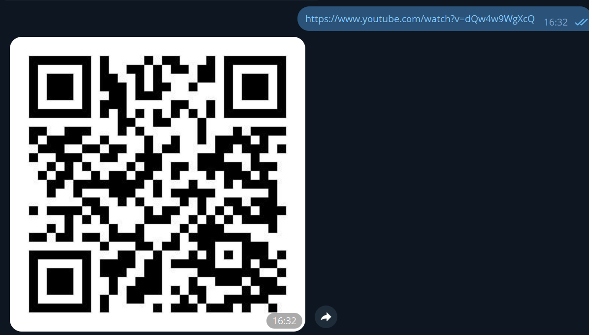

# Телеграм бот для генерации QR кодов по тексту


## Пример работы

Команда `/start`


Создание QR кода


Чтение QR кода


## Особенности запуска

Для запуска вам потребуется создать файл `application.yml` в папке `resources`

и укзать в нем настройки токена и имени бота

```yml
token: asdasdasdsadsada123aassdsas1k3jdksd
name: My_tre_ning_bot
```
